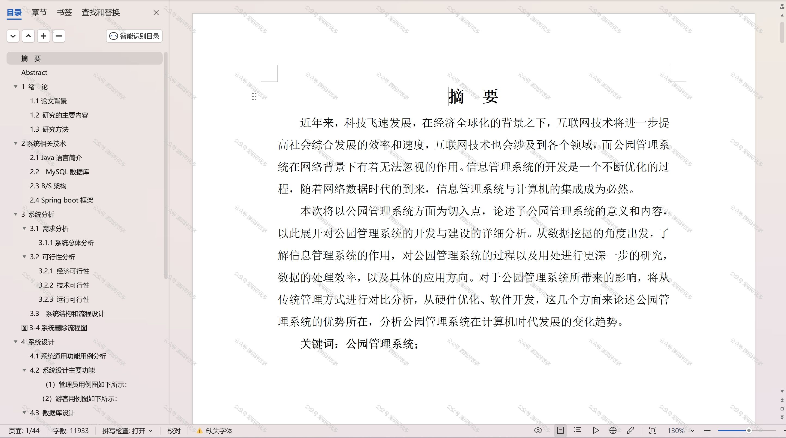

 
## 查看主页获取源码

### 一、作品包含

源码+数据库+设计文档万字+PPT+全套环境和工具资源+部署教程

### 二、项目技术

前端技术：Html、Css、Js、Vue、Element-ui

数据库：MySQL

后端技术：Java、Spring Boot、MyBatis

  

### 三、运行环境

开发工具：IDEA/eclipse

数据库：MySQL5.7

数据库管理工具：Navicat10以上版本

环境配置软件： JDK1.8+Maven3.6.3

前端Nodejs：14

### 四、项目介绍
项目编号：springbootA184

公园管理系统是为了提升公园日常运营效率、优化游客体验和保障公园资源可持续利用而设计的。通过信息化手段，帮助公园管理者实现对园区资源的有效监控和科学管理，确保公园环境整洁、秩序井然，为游客提供一个舒适、便捷的休闲环境。

前台用户功能：浏览首页、场地信息、游玩项目、公园设施、公告信息和个人信息。

后台分为管理员和用户
管理员的功能：系统首页、个人中心、游客管理、场地类型管理、场地信息管理、场地预约管理、项目分类管理、游玩项目管理、游玩预约管理、设施分类管理、公园设施管理、设施维护管理、游客统计管理、系统管理。
用户的功能：系统首页、个人中心、场地预约管理、游玩预约管理、我的收藏管理。

### 五、运行截图

  
